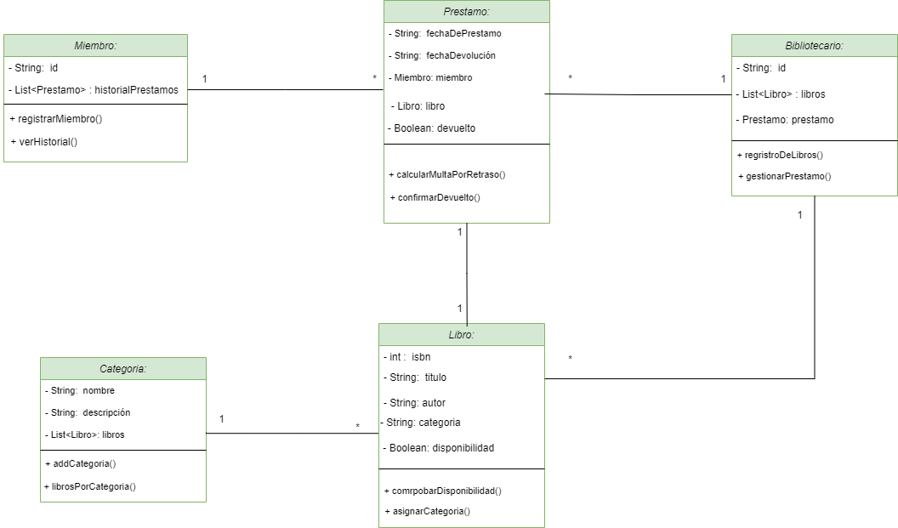
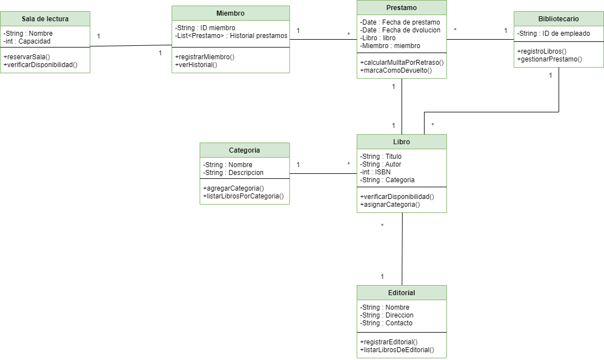

# Diagramas-y-clases
<br>

#  Ejercicicio 1#: sistemas de reservas de hoteles.

# Cliente:

````
package es.ies.puerto;
/**
 * @author habccode
 * @version 1.0.0
 */
import java.util.List;
import java.util.Objects;

public class Cliente {
    private String nombre;
    private int numeroDeContacto;
    private String correoElectronico;
    private List<Reserva> reservas;

    /**
     * Constructor por defecto.
     */
    public Cliente() {}

    /**
     * Constructor general.
     * @param nombre
     * @param numeroDeContacto
     * @param correoElectronico
     * @param reservas
     */
    public Cliente(String nombre, int numeroDeContacto, String correoElectronico, List<Reserva> resrvas) {
        this.nombre = nombre;
        this.numeroDeContacto = numeroDeContacto;
        this.correoElectronico = correoElectronico;
        this.reservas = resrvas;
    }

    public String getNombre() {
        return this.nombre;
    }

    public void setNombre(String nombre) {
        this.nombre = nombre;
    }

    public int getNumeroDeContacto() {
        return this.numeroDeContacto;
    }

    public void setNumeroDeContacto(int numeroDeContacto) {
        this.numeroDeContacto = numeroDeContacto;
    }

    public String getCorreoElectronico() {
        return this.correoElectronico;
    }

    public void setCorreoElectronico(String correoElectronico) {
        this.correoElectronico = correoElectronico;
    }

    public List<Reserva> getReservas() {
        return this.reservas;
    }

    public void setReservas(List<Reserva> resrvas) {
        this.reservas = resrvas;
    }

    /**
     * Funcíon para registrar un cliente.
     * @return
     */
    public boolean registrarCliente() {
        return false;
    }

    /**
     * Función para obtener información.
     * @return
     */
    public String obtenerInformacion() {
        return "";
    }

    @Override
    public boolean equals(Object o) {
        if (o == this) return true;
        if (!(o instanceof Cliente)) return false;
        Cliente cliente = (Cliente) o;
        return Objects.equals(nombre, cliente.nombre) && 
                              numeroDeContacto == cliente.numeroDeContacto && 
               Objects.equals(correoElectronico, cliente.correoElectronico) && 
               Objects.equals(reservas, cliente.reservas);
    }

    @Override
    public int hashCode() {
        return Objects.hash(nombre, numeroDeContacto, correoElectronico, reservas);
    }

    @Override
    public String toString() {
        return "{" +
            " nombre='" + getNombre() + "'" +
            ", numeroDeContacto='" + getNumeroDeContacto() + "'" +
            ", correoElectronico='" + getCorreoElectronico() + "'" +
            ", resrvas='" + getReservas() + "'" +
            "}";
    }
    
}

````


# Reserva:

````
package es.ies.puerto;
import java.util.Date;
import java.util.Objects;
/**
 * @author habccode
 * @version 1.0.0
 */
public class Reserva {
    private Date fechaDeEntrada;
    private Date fechaDeSalida;
    private Cliente cliente;
    private Habitacion habitacion;
    private Boolean confirmacion;

    /**
     * Constructor por defecto.
     */
    public Reserva() {}

    /**
     * Constructor general.
     * @param fechaDeEntrada
     * @param fechaDeSalida
     * @param cliente
     * @param habitacion
     * @param confirmacion
     */
    public Reserva(Date fechaDeEntrada, Date fechaDeSalida, Cliente cliente, Habitacion habitacion, Boolean confirmacion) {
        this.fechaDeEntrada = fechaDeEntrada;
        this.fechaDeSalida = fechaDeSalida;
        this.cliente = cliente;
        this.habitacion = habitacion;
        this.confirmacion = confirmacion;
    }

    public Date getFechaDeEntrada() {
        return this.fechaDeEntrada;
    }

    public void setFechaDeEntrada(Date fechaDeEntrada) {
        this.fechaDeEntrada = fechaDeEntrada;
    }

    public Date getFechaDeSalida() {
        return this.fechaDeSalida;
    }

    public void setFechaDeSalida(Date fechaDeSalida) {
        this.fechaDeSalida = fechaDeSalida;
    }

    public Cliente getCliente() {
        return this.cliente;
    }

    public void setCliente(Cliente cliente) {
        this.cliente = cliente;
    }

    public Habitacion getHabitacion() {
        return this.habitacion;
    }

    public void setHabitacion(Habitacion habitacion) {
        this.habitacion = habitacion;
    }

    public Boolean isConfirmacion() {
        return this.confirmacion;
    }

    public Boolean getConfirmacion() {
        return this.confirmacion;
    }

    public void setConfirmacion(Boolean confirmacion) {
        this.confirmacion = confirmacion;
    }

    /**
     * Función para calcular el costo de una reserva.
     * @return
     */
    public float calcularCostoTotal() {
        return 0.0f;
    }

    /**
     * Función para confirmar una reserva.
     * @return
     */
    public boolean confirmarReserva() {
        return false;
    }

    @Override
    public boolean equals(Object o) {
        if (o == this) return true;
        if (!(o instanceof Reserva)) return false;
        Reserva reserva = (Reserva) o;
        return Objects.equals(fechaDeEntrada, reserva.fechaDeEntrada) && 
               Objects.equals(fechaDeSalida, reserva.fechaDeSalida) && 
               Objects.equals(cliente, reserva.cliente) && 
               Objects.equals(habitacion, reserva.habitacion) && 
               Objects.equals(confirmacion, reserva.confirmacion);
    }

    @Override
    public int hashCode() {
        return Objects.hash(fechaDeEntrada, fechaDeSalida, cliente, habitacion, confirmacion);
    }

    @Override
    public String toString() {
        return "{" +
            " fechaDeEntrada='" + getFechaDeEntrada() + "'" +
            ", fechaDeSalida='" + getFechaDeSalida() + "'" +
            ", cliente='" + getCliente() + "'" +
            ", habitacion='" + getHabitacion() + "'" +
            ", confirmacion='" + isConfirmacion() + "'" +
            "}";
    }
}

````


# Habitación:
````
package es.ies.puerto;
import java.util.List;
import java.util.Objects;
/**
 * @author habccode
 * @version 1.0.0
 */
public class Habitacion {
    private int numeroDeHabitacion;
    private String tipoDeHabitacion;
    private float precioNoche;
    private List<Reserva> reservas;
    private boolean disponibilidad;

    /**
     * Constructor vacio.
     */
    public Habitacion() {}

    /**
     * Constructor general.
     * @param numeroDeHabitacion
     * @param tipoDeHabitacion
     * @param precioNoche
     * @param reservas
     * @param disponibilidad
     */
    public Habitacion(int numeroDeHabitacion, String tipoDeHabitacion, float precioNoche, List<Reserva> reservas, boolean disponibilidad) {
        this.numeroDeHabitacion = numeroDeHabitacion;
        this.tipoDeHabitacion = tipoDeHabitacion;
        this.precioNoche = precioNoche;
        this.reservas = reservas;
        this.disponibilidad = disponibilidad;
    }

    public int getNumeroDeHabitacion() {
        return this.numeroDeHabitacion;
    }

    public void setNumeroDeHabitacion(int numeroDeHabitacion) {
        this.numeroDeHabitacion = numeroDeHabitacion;
    }

    public String getTipoDeHabitacion() {
        return this.tipoDeHabitacion;
    }

    public void setTipoDeHabitacion(String tipoDeHabitacion) {
        this.tipoDeHabitacion = tipoDeHabitacion;
    }

    public float getPrecioNoche() {
        return this.precioNoche;
    }

    public void setPrecioNoche(float precioNoche) {
        this.precioNoche = precioNoche;
    }

    public List<Reserva> getReservas() {
        return this.reservas;
    }

    public void setReservas(List<Reserva> reservas) {
        this.reservas = reservas;
    }

    public boolean getDisponibilidad() {
        return this.disponibilidad;
    }

    public void setDisponibilidad(boolean disponibilidad) {
        this.disponibilidad = disponibilidad;
    }

    /**
     * Función para comprobar la disponibilidad.
     * @return
     */
    public boolean comprobarDisponobilidad() {
        return false;
    }

    /**
     * Función para cambiar el estado.
     * @return
     */
    public boolean cambiarEstado() {
        return false;
    }

    @Override
    public boolean equals(Object o) {
        if (o == this) return true;
        if (!(o instanceof Habitacion)) return false;
        Habitacion habitacion = (Habitacion) o;
        return numeroDeHabitacion == habitacion.numeroDeHabitacion && 
        Objects.equals(tipoDeHabitacion, habitacion.tipoDeHabitacion) && 
                       precioNoche == habitacion.precioNoche && 
        Objects.equals(reservas, habitacion.reservas) && 
                       disponibilidad == habitacion.disponibilidad;
    }

    @Override
    public int hashCode() {
        return Objects.hash(numeroDeHabitacion, tipoDeHabitacion, precioNoche, reservas, disponibilidad);
    }

    @Override
    public String toString() {
        return "{" +
            " numeroDeHabitacion='" + getNumeroDeHabitacion() + "'" +
            ", tipoDeHabitacion='" + getTipoDeHabitacion() + "'" +
            ", precioNoche='" + getPrecioNoche() + "'" +
            ", reservas='" + getReservas() + "'" +
            ", disponibilidad='" + getDisponibilidad() + "'" +
            "}";
    }
}

````
<br>

 # Sistemas de Reservas: 


<br>

<br>
<br>
<br>

  # Ejercicio 2#: Sistemas de gestión de bibliotecas. 
 <br>


 #  Sistema de bibliotecas A: 

# Miembro:

````
package main.java.es.ies.puerto.biblioteca_a;
import java.util.List;
import java.util.Objects;
/**
 * @author habccode
 * @version 1.0.0
 */
public class Miembro {
    private String id;
    private List<Prestamo> historialPrestamos;

    /**
     * Constructor por defecto.
     */
    public Miembro() {}

    /**
     * Constructor solo con el id.
     * @param id
     */
    public Miembro(String id) {
        this.id = id;
    }

    /**
     * Constructor general.
     * @param id
     * @param historialPrestamos
     */
    public Miembro(String id, List<Prestamo> historialPrestamos) {
        this.id = id;
        this.historialPrestamos = historialPrestamos;
    }

    public String getId() {
        return this.id;
    }

    public void setId(String id) {
        this.id = id;
    }

    public List<Prestamo> getHistorialPrestamos() {
        return this.historialPrestamos;
    }

    public void setHistorialPrestamos(List<Prestamo> historialPrestamos) {
        this.historialPrestamos = historialPrestamos;
    }

    /**
     * Función que registra un miembro.
     * @return
     */
    public boolean registrarMiembro() {
        return false;
    }

    /**
     * Función que muestra el historial.
     * @return
     */
    public List<Prestamo> verHistorial() {
        return null;
    }

    @Override
    public boolean equals(Object o) {
        if (o == this) return true;
        if (!(o instanceof Miembro)) return false;
        Miembro miembro = (Miembro) o;
        return Objects.equals(id, miembro.id);
        }

    @Override
    public int hashCode() {
        return Objects.hash(id, historialPrestamos);
    }

    @Override
    public String toString() {
        return "{" +
            " id='" + getId() + "'" +
            ", historialPrestamos='" + getHistorialPrestamos() + "'" +
            "}";
    }
}
````


  # Prestamo: 

  ````
  package main.java.es.ies.puerto.biblioteca_a;
import java.sql.Date;
import java.util.Objects;
/**
 * @author habccode
 * @version 1.0.0
 */
public class Prestamo {
    private Date fechaPrestamo;
    private Date fechaDevolucion;
    private Libro libro;
    private Miembro miembro;
    private boolean deVuelto;

    /**
     * Constructor por defecto.
     */
    public Prestamo() {}

    /**
     * Constructor general.
     * @param fechaPrestamo
     * @param fechaDevolucion
     * @param libro
     * @param miembro
     * @param deVuelto
     */
    public Prestamo(Date fechaPrestamo, Date fechaDevolucion, Libro libro, Miembro miembro, boolean deVuelto) {
        this.fechaPrestamo = fechaPrestamo;
        this.fechaDevolucion = fechaDevolucion;
        this.libro = libro;
        this.miembro = miembro;
        this.deVuelto = deVuelto;
    }

    public Date getFechaPrestamo() {
        return this.fechaPrestamo;
    }

    public void setFechaPrestamo(Date fechaPrestamo) {
        this.fechaPrestamo = fechaPrestamo;
    }

    public Date getFechaDevolucion() {
        return this.fechaDevolucion;
    }

    public void setFechaDevolucion(Date fechaDevolucion) {
        this.fechaDevolucion = fechaDevolucion;
    }

    public Libro getLibro() {
        return this.libro;
    }

    public void setLibro(Libro libro) {
        this.libro = libro;
    }

    public Miembro getMiembro() {
        return this.miembro;
    }

    public void setMiembro(Miembro miembro) {
        this.miembro = miembro;
    }

    public boolean getDeVuelto() {
        return this.deVuelto;
    }

    public void setDeVuelto(boolean deVuelto) {
        this.deVuelto = deVuelto;
    }

    /**
     * Función que calcula la multa por retraso.
     * @return
     */
    public float calcularMultaPorRetraso() {
        return 0.0f;
    }

    /**
     * Función que marca como deVuelto.
     * @return
     */
    public boolean marcaComoDeVuelto() {
        return false;
    }

    @Override
    public boolean equals(Object o) {
        if (o == this) return true;
        if (!(o instanceof Prestamo)) return false;
        Prestamo prestamo = (Prestamo) o;
        return Objects.equals(fechaPrestamo, prestamo.fechaPrestamo) && 
               Objects.equals(fechaDevolucion, prestamo.fechaDevolucion) && 
               Objects.equals(libro, prestamo.libro) && 
               Objects.equals(miembro, prestamo.miembro) && 
                              deVuelto == prestamo.deVuelto;
    }

    @Override
    public int hashCode() {
        return Objects.hash(fechaPrestamo, fechaDevolucion, libro, miembro, deVuelto);
    }

    @Override
    public String toString() {
        return "{" +
            " fechaPrestamo='" + getFechaPrestamo() + "'" +
            ", fechaDevolucion='" + getFechaDevolucion() + "'" +
            ", libro='" + getLibro() + "'" +
            ", miembro='" + getMiembro() + "'" +
            ", deVuelto='" + getDeVuelto() + "'" +
            "}";
    }
}
  ````

  # Bibliotecario: 
  
  ````
  package main.java.es.ies.puerto.biblioteca_a;
import java.util.List;
import java.util.Objects;
/**
 * @author habccode
 * @version 1.0.0
 */
public class Bibliotecario {
    private String id;
    private List<Libro> libros;
    private Prestamo prestamo;

    /**
     * Constructor por defecto.
     */
    public Bibliotecario() {}

    /**
     * Constructor solo con el id.
     * @param id
     */
    public Bibliotecario(String id) {
        this.id = id;
    }

    /**
     * Constructor general.
     * @param id
     * @param libros
     * @param prestamo
     */
    public Bibliotecario(String id, List<Libro> libros, Prestamo prestamo) {
        this.id = id;
        this.libros = libros;
        this.prestamo = prestamo;
    }

    public String getId() {
        return this.id;
    }

    public void setId(String id) {
        this.id = id;
    }

    public List<Libro> getLibros() {
        return this.libros;
    }

    public void setLibros(List<Libro> libros) {
        this.libros = libros;
    }

    public Prestamo getPrestamo() {
        return this.prestamo;
    }

    public void setPrestamo(Prestamo prestamo) {
        this.prestamo = prestamo;
    }

    /**
     * Función que registra libros.
     * @return
     */
    public List<Libro> registroLibros() {
        return null;
    }

    /**
     * Función que gestiona un prestamo.
     * @return
     */
    public Prestamo gestionarPrestamo() {
        return null;
    }

    @Override
    public boolean equals(Object o) {
        if (o == this) return true;
        if (!(o instanceof Bibliotecario)) return false;
        Bibliotecario bibliotecario = (Bibliotecario) o;
        return Objects.equals(id, bibliotecario.id);
    }

    @Override
    public int hashCode() {
        return Objects.hash(id, libros, prestamo);
    }

    @Override
    public String toString() {
        return "{" +
            " id='" + getId() + "'" +
            ", libros='" + getLibros() + "'" +
            ", prestamo='" + getPrestamo() + "'" +
            "}";
    }
}
  ````


  # Libro:

  ````
  package main.java.es.ies.puerto.biblioteca_a;
import java.util.List;
import java.util.Objects;
/**
 * @author habccode
 * @version 1.0.0
 */
public class Miembro {
    private String id;
    private List<Prestamo> historialPrestamos;

    /**
     * Constructor por defecto.
     */
    public Miembro() {}

    /**
     * Constructor solo con el id.
     * @param id
     */
    public Miembro(String id) {
        this.id = id;
    }

    /**
     * Constructor general.
     * @param id
     * @param historialPrestamos
     */
    public Miembro(String id, List<Prestamo> historialPrestamos) {
        this.id = id;
        this.historialPrestamos = historialPrestamos;
    }

    public String getId() {
        return this.id;
    }

    public void setId(String id) {
        this.id = id;
    }

    public List<Prestamo> getHistorialPrestamos() {
        return this.historialPrestamos;
    }

    public void setHistorialPrestamos(List<Prestamo> historialPrestamos) {
        this.historialPrestamos = historialPrestamos;
    }

    /**
     * Función que registra un miembro.
     * @return
     */
    public boolean registrarMiembro() {
        return false;
    }

    /**
     * Función que muestra el historial.
     * @return
     */
    public List<Prestamo> verHistorial() {
        return null;
    }

    @Override
    public boolean equals(Object o) {
        if (o == this) return true;
        if (!(o instanceof Miembro)) return false;
        Miembro miembro = (Miembro) o;
        return Objects.equals(id, miembro.id);
        }

    @Override
    public int hashCode() {
        return Objects.hash(id, historialPrestamos);
    }

    @Override
    public String toString() {
        return "{" +
            " id='" + getId() + "'" +
            ", historialPrestamos='" + getHistorialPrestamos() + "'" +
            "}";
    }
}
  ````
<br>


  # Categoria: 
  
  
  ````
  package main.java.es.ies.puerto.biblioteca_a;
import java.util.List;
import java.util.Objects;
/**
 * @author habccode
 * @version 1.0.0
 */
public class Categoria {
    private String nombre;
    private String descripcion;
    private List<Libro> libros;

    /**
     * Constructor por defecto.
     */
    public Categoria() {
    }

    /**
     * Constructor general.
     * @param nombre
     * @param descripcion
     * @param libros
     */
    public Categoria(String nombre, String descripcion, List<Libro> libros) {
        this.nombre = nombre;
        this.descripcion = descripcion;
        this.libros = libros;
    }

    public String getNombre() {
        return this.nombre;
    }

    public void setNombre(String nombre) {
        this.nombre = nombre;
    }

    public String getDescripcion() {
        return this.descripcion;
    }

    public void setDescripcion(String descripcion) {
        this.descripcion = descripcion;
    }

    public List<Libro> getLibros() {
        return this.libros;
    }

    public void setLibros(List<Libro> libros) {
        this.libros = libros;
    }

    /**
     * Función que agrega a una categoria.
     * @return
     */
    public boolean addCategoria() {
        return false;
    }

    /**
     * Función que lista libros por categoria.
     * @return
     */
    public List<Libro> LibrosPorCategoria() {
        return null;
    }

    @Override
    public boolean equals(Object o) {
        if (o == this) return true;
        if (!(o instanceof Categoria)) return false;
        Categoria categoria = (Categoria) o;
        return Objects.equals(nombre, categoria.nombre) && 
               Objects.equals(descripcion, categoria.descripcion) && 
               Objects.equals(libros, categoria.libros);
    }

    @Override
    public int hashCode() {
        return Objects.hash(nombre, descripcion, libros);
    }

    @Override
    public String toString() {
        return "{" +
            " nombre='" + getNombre() + "'" +
            ", descripcion='" + getDescripcion() + "'" +
            ", libros='" + getLibros() + "'" +
            "}";
    }
}
  ````

    
<br>
<br>


<br>
<br>
<br>
<br>


  # Sistema de gestión de blibliotecas B:

  # Sala de lectura:

  ````
  package test.java.es.ies.puerto.biblioteca_b;


import java.util.Objects;
/**
 * @author habccode
 * @version 1.0.0
 */
public class SalaLectura {
    private String nombre;
    private int capacidad;

    /**
     * Constructor por defecto.
     */
    public SalaLectura() {
    }

    /**
     * Constructor general.
     * @param nombre
     * @param capacidad
     */
    public SalaLectura(String nombre, int capacidad) {
        this.nombre = nombre;
        this.capacidad = capacidad;
    }

    public String getNombre() {
        return this.nombre;
    }

    public void setNombre(String nombre) {
        this.nombre = nombre;
    }

    public int getCapacidad() {
        return this.capacidad;
    }

    public void setCapacidad(int capacidad) {
        this.capacidad = capacidad;
    }

    /**
     * Función que reserva una sala.
     * @return
     */
    public boolean reservarSala() {
        return false;
    }

    /**
     * Función que verifica la disponibilidad.
     * @return
     */
    public boolean verificarDisponibilidad() {
        return false;
    }

    @Override
    public boolean equals(Object o) {
        if (o == this) return true;
        if (!(o instanceof SalaLectura)) return false;
        SalaLectura salaLectura = (SalaLectura) o;
        return Objects.equals(nombre, salaLectura.nombre) && 
                              capacidad == salaLectura.capacidad;
    }

    @Override
    public int hashCode() {
        return Objects.hash(nombre, capacidad);
    }

    @Override
    public String toString() {
        return "{" +
            " nombre='" + getNombre() + "'" +
            ", capacidad='" + getCapacidad() + "'" +
            "}";
    }
}
  ````


# Editorial:

````
package main.java.es.ies.puerto.biblioteca_b;
import java.util.List;
import java.util.Objects;
/**
 * @author habccode
 * @version 1.0.0
 */
public class Editorial {
    private String nombre;
    private String direccion;
    private String contacto;

    /**
     * Constructor por defecto.
     */
    public Editorial() {
    }

    /**
     * Constructor genreal.
     * @param nombre
     * @param direccion
     * @param contacto
     */
    public Editorial(String nombre, String direccion, String contacto) {
        this.nombre = nombre;
        this.direccion = direccion;
        this.contacto = contacto;
    }

    public String getNombre() {
        return this.nombre;
    }

    public void setNombre(String nombre) {
        this.nombre = nombre;
    }

    public String getDireccion() {
        return this.direccion;
    }

    public void setDireccion(String direccion) {
        this.direccion = direccion;
    }

    public String getContacto() {
        return this.contacto;
    }

    public void setContacto(String contacto) {
        this.contacto = contacto;
    }

    /**
     * Función para registrar una editorial.
     * @return
     */
    public boolean registrarEditorial() {
        return false;
    }

    /**
     * Función que lista los libros de una editorial.
     * @return
     */
    public List<Libro> listarLibrosDeEditorial() {
        return null;
    }

    @Override
    public boolean equals(Object o) {
        if (o == this) return true;
        if (!(o instanceof Editorial)) return false;
        Editorial editorial = (Editorial) o;
        return Objects.equals(nombre, editorial.nombre) && 
               Objects.equals(direccion, editorial.direccion) && 
               Objects.equals(contacto, editorial.contacto);
    }

    @Override
    public int hashCode() {
        return Objects.hash(nombre, direccion, contacto);
    }

    @Override
    public String toString() {
        return "{" +
            " nombre='" + getNombre() + "'" +
            ", direccion='" + getDireccion() + "'" +
            ", contacto='" + getContacto() + "'" +
            "}";
    }
}
````

<br>
<br>




